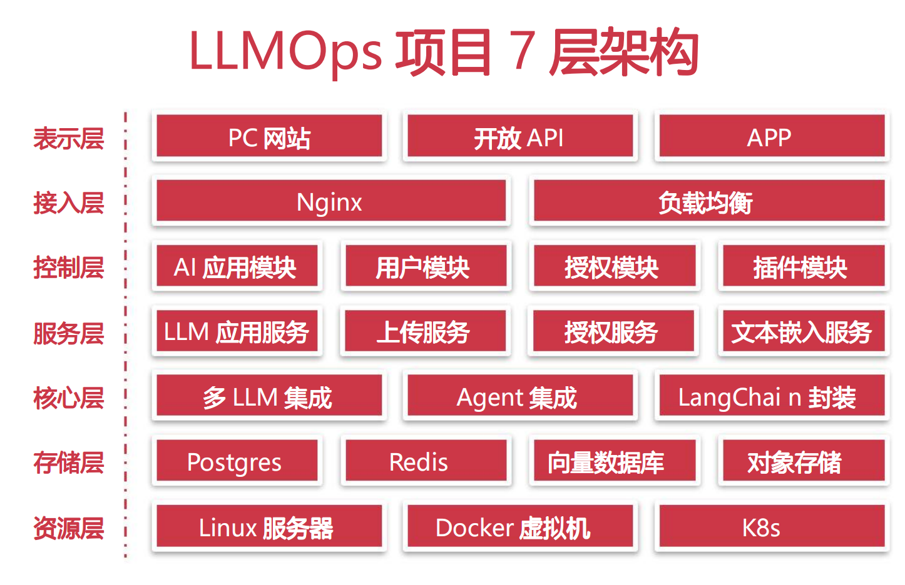
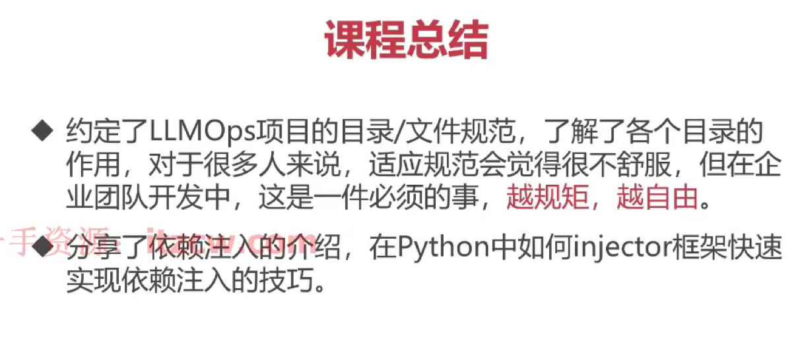

## 
当你做一件事情非常费力的时候，那么做这件事情的方法可能不太对.

## python 
python 版本之间的差异:

## 虚拟环境搭建
python -m venv env  创建虚拟环境
source env/bin/activate   激活
deactivate 退出

## pip 镜像加速,提升安装包的速度.
腾讯云pip 镜像
全局使用: pip config set global.index-url https://mirrors.cloud.tencent.com/pypi/simple

全局使用: pip config set global.index-url https://pypi.tuna.tsinghua.edu.cn/simple/
临时使用: pip install -r requirements.txt -i https://pypi.tuna.tsinghua.edu.cn/simple/

阿里云pip 镜像
全局使用: pip config set global.index-url https://mirrors.aliyun.com/pypi/simple/
临时使用: pip install -r requirements.txt -i https://mirrors.aliyun.com/pypi/simple/

## LLMOPS 7 层架构


## 项目框架的选择
Django 是一个全功能的 Web 框架，适合开发大型应用。
Flask 是一个轻量级的 Web 框架，适合快速开发小型应用。
根据项目需求和团队技能，选择合适的框架。如果是大型项目，考虑使用 Django；如果是小型项目，考虑使用 Flask。

LLM 选择框架 langchain, 因为它提供了丰富的功能和组件，方便开发 LLM 应用。

## 项目目录结构约定、规范与依赖注入.
 pip install injector

```aiignore
from injector import Injector,inject

class A:
    name: str = "llmops"

@inject
class B:
    def __init__(self, a: A):
        self.a = a

    def print_name(self):
        print(self.a.name)

injector = Injector()
b = injector.get(B)
b.print_name()
```

## 总结



## 测试，运行环境配置
     export PYTHONPATH=/Users/apple/Desktop/python/llm-ops/llmops:$PYTHONPATH
     python /Users/apple/Desktop/python/llm-ops/llmops/app/http/app.py

## 安装依赖
pip freeze
pip freeze > requirements.txt
pipreqs 依赖生成
https://pypi.org/project/pipreqs/
pipreqs --ignore venv --force

生成 requirements.txt 文件
pipreqs --ignore venv --force

根据依赖去安装
pip install -r requirements.txt

这个包如何使用 pipreqs


