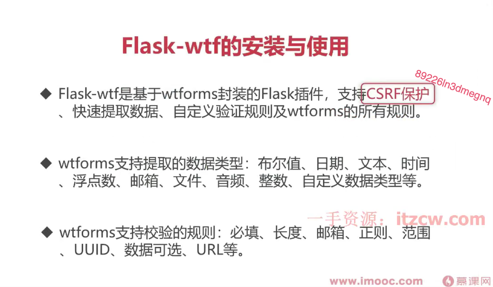

## 
当你做一件事情非常费力的时候，那么做这件事情的方法可能不太对.

## python 
python 版本之间的差异:

## 虚拟环境搭建
python -m venv env  创建虚拟环境
source env/bin/activate   激活
deactivate 退出

## pip 镜像加速,提升安装包的速度.
腾讯云pip 镜像
全局使用: pip config set global.index-url https://mirrors.cloud.tencent.com/pypi/simple

全局使用: pip config set global.index-url https://pypi.tuna.tsinghua.edu.cn/simple/
临时使用: pip install -r requirements.txt -i https://pypi.tuna.tsinghua.edu.cn/simple/

阿里云pip 镜像
全局使用: pip config set global.index-url https://mirrors.aliyun.com/pypi/simple/
临时使用: pip install -r requirements.txt -i https://mirrors.aliyun.com/pypi/simple/

## LLMOPS 7 层架构


## 项目框架的选择
Django 是一个全功能的 Web 框架，适合开发大型应用。
Flask 是一个轻量级的 Web 框架，适合快速开发小型应用。
根据项目需求和团队技能，选择合适的框架。如果是大型项目，考虑使用 Django；如果是小型项目，考虑使用 Flask。

LLM 选择框架 langchain, 因为它提供了丰富的功能和组件，方便开发 LLM 应用。

## 项目目录结构约定、规范与依赖注入.
 pip install injector

```aiignore
from injector import Injector,inject

class A:
    name: str = "llmops"

@inject
class B:
    def __init__(self, a: A):
        self.a = a

    def print_name(self):
        print(self.a.name)

injector = Injector()
b = injector.get(B)
b.print_name()
```

## 总结


## 测试，运行环境配置
     export PYTHONPATH=/Users/apple/Desktop/python/llm-ops/llmops:$PYTHONPATH
     python /Users/apple/Desktop/python/llm-ops/llmops/app/http/app.py

   export PYTHONPATH="${PYTHONPATH}:/Users/apple/Desktop/python/llm-ops"
   
## 安装依赖
pip freeze
pip freeze > requirements.txt
pipreqs 依赖生成
https://pypi.org/project/pipreqs/
pipreqs --ignore venv --force

生成 requirements.txt 文件
pipreqs --ignore venv --force

根据依赖去安装
pip install -r requirements.txt

这个包如何使用 pipreqs

# postgres 数据库
docker run -d --name postgres -p 5432:5432 -e POSTGRES_USER=postgres -e POSTGRES_PASSWORD=postgres -e POSTGRES_DB=postgres postgres

docker exec -it postgres bash

psql -U postgres -d postgres


##  使用 Postgres 作为数据库方案.
* 添加Flask-SQLAlchemy 和 Flask-Migrate 扩展.
* 创建数据库模型.


## Flask-wtf 的安装和使用
支持csrf 保护
支持规则验证
数据类型验证
快速提取数据
https://flask-wtf.readthedocs.io/en/1.2.x/install/#
https://wtforms.readthedocs.io/en/3.2.x/ 




## 自定义异常:

## PyTest 配置与 API 测试用例case

## SQLAIchemy 的配置和使用.
https://flask-sqlalchemy.palletsprojects.com/en/2.x/config/

## Flask-Migrate 的安装和使用.
https://flask-migrate.readthedocs.io/en/latest/

## Flask-SQLAlchemy扩展的配置与使用
[已经学完]

## 应用ORM模型的创建与增删改查
[已经学完]

## 创建一个Flask应用，并使用Flask-SQLAlchemy扩展进行数据库操作.
service 层
主要来处理业务逻辑

handle controller 层
主要来是做控制器的处理

model 模型层
主要来做表结构生成

router 路由层
主要来做路由处理

python -m app.http.app  运行

## 重写SQLAlchemy核心类实现自动提交

## Flask-Migrate扩展介绍与使用

-----  2025年12月21日  --- 

## 为什么选择LangChain及LangChain简介

## LangChain框架安装及文档介绍

## Prompt组件及使用技巧

## Model组件及使用技巧

## OutputParser组件及使用技巧

## LCEL表达式与Runnable可运行协议

## 两个Runnable核心类的讲解与使用

## 利用回调功能调试链应用-让过程更透明.

## API接口文档介绍与接口统一.

使用AI 帮我推测未来的结果，让后我将根据未来的结果，利用未来的认知改变现在的自己.


